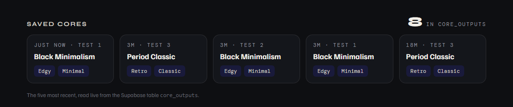

# Supabase Evidence — table `core_outputs`

**Project:** `ssyqkfqwhpvahtefmxdy` (Supabase Free, AWS us-east-2)
**Table:** `public.core_outputs`, created from `supabase/core_outputs.sql`
**Date:** 10 September 2026

---

## Before anything could be stored: the project was paused

The Supabase project created in Week 0 had been paused automatically — free
projects pause after a week without activity. It was resumed from the
dashboard (free, no plan change), restored in a few minutes, and only then
could the table be created. Noted because it will happen again: a paused
project makes the live page's Save fail, and the page is built to say so
rather than break.

## The table was created from the repository

`supabase/core_outputs.sql` was run in the SQL editor: *"Success. No rows
returned."* The editor flagged it as containing destructive operations — the
`drop policy if exists` and `revoke` lines that make the script safe to re-run.
They only touch the policies and grants of this one table.

## What the database holds

Read-only query run in the Supabase SQL editor at 20:25, copied verbatim
(times in Mexico City, UTC−6):

| saved_at | label | archetype | occasion | budget | confidence | engine |
|---|---|---|---|---|---|---|
| 10 Sep 19:58 | dev smoke test | Neo-classic | everyday | 300 | high | rules-v1 |
| 10 Sep 20:02 | Test 1 | Black Minimalism | work | 300 | medium | rules-v1 |
| 10 Sep 20:02 | Test 2 | Black Minimalism | everyday | none | medium | rules-v1 |
| 10 Sep 20:02 | Test 3 | Period Classic | weekend | 150 | high | rules-v1 |
| 10 Sep 20:18 | Test 1 | Black Minimalism | work | 300 | medium | rules-v1 |
| 10 Sep 20:18 | Test 2 | Black Minimalism | everyday | none | medium | rules-v1 |
| 10 Sep 20:18 | Test 3 | Period Classic | weekend | 150 | high | rules-v1 |
| 10 Sep 20:21 | Test 1 | Black Minimalism | work | 300 | medium | rules-v1 |
| 10 Sep 20:21 | Test 2 | Black Minimalism | everyday | none | medium | rules-v1 |
| 10 Sep 20:21 | Test 3 | Period Classic | weekend | 150 | high | rules-v1 |

One local smoke test before the first deployment with the key, then three
rounds of the scripted live tests: Round 1 at 20:02, Round 2 at 20:18 and
again at 20:21 to capture screenshots without the "Saved" notification over
the card. Every row was written by the live page's Save button — no row was
inserted by hand.

## What the public key can and cannot do

Second read-only query, same editor:

| Check | Result |
|---|---|
| rows in core_outputs | 10 |
| rows whose input_text is stored | 10 |
| row level security enabled | true |
| policies | public can save a core (INSERT); public can read cores (SELECT) |
| anon table-level grants | none |
| anon may SELECT columns | archetype, axes, budget, confidence, created_at, engine, id, key_pieces, label, occasion, signals, thesis, top_axes |
| anon may INSERT columns | archetype, axes, budget, confidence, engine, input_text, key_pieces, label, occasion, signals, thesis, top_axes |

`input_text` is stored in every row and is absent from what the public key may
read. `id` and `created_at` are absent from what it may write, so the database
always sets them itself.

And from the outside, with the publishable key the site ships, against the
REST endpoint — run from PowerShell before the key was committed, and again
from the live page by test S1:

| Request | Status | Response |
|---|---|---|
| `GET ?select=id,archetype` | 200 | the rows |
| `GET ?select=input_text` | 401 | `42501 permission denied for table core_outputs` |
| `GET ?select=*` | 401 | `42501 permission denied for table core_outputs` |
| `PATCH` | 401 | `42501 permission denied for table core_outputs` |
| `DELETE` | 401 | `42501 permission denied for table core_outputs` |

The dashboard on `/core` reads the same table through the same key:

