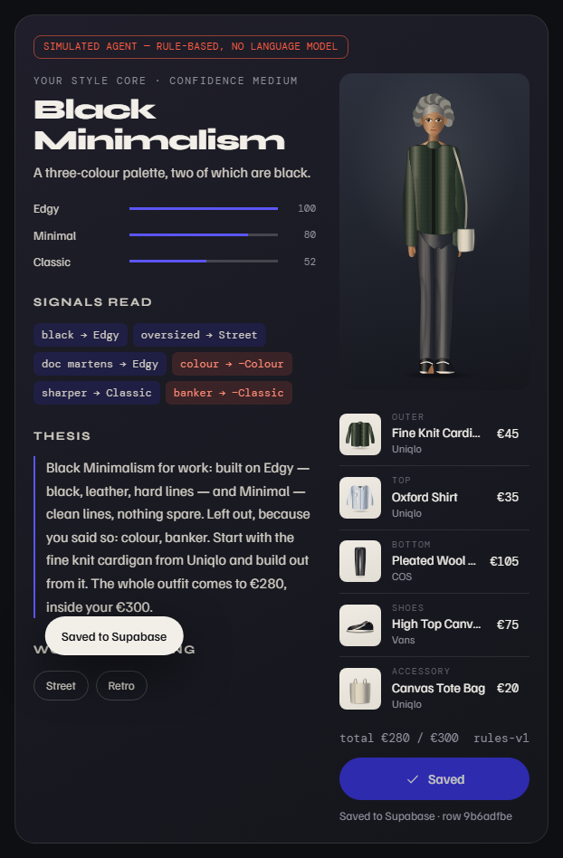
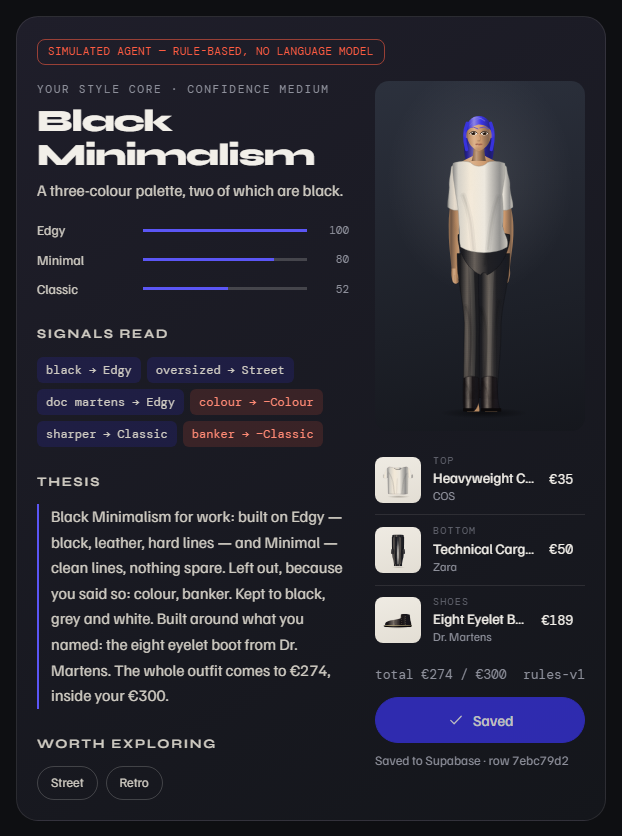
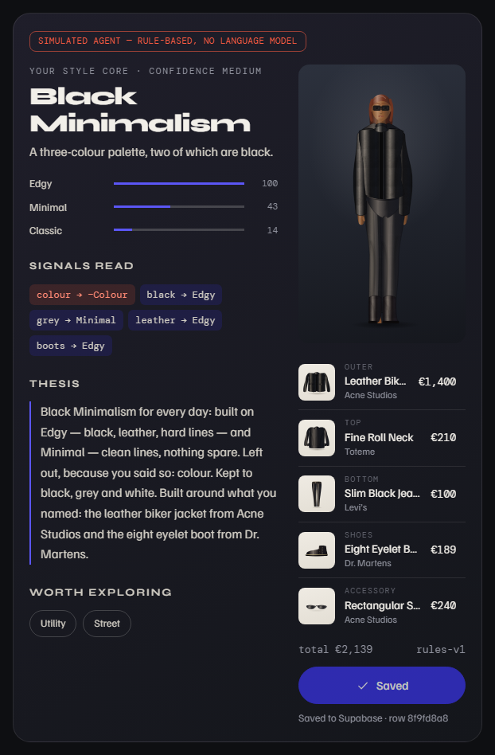
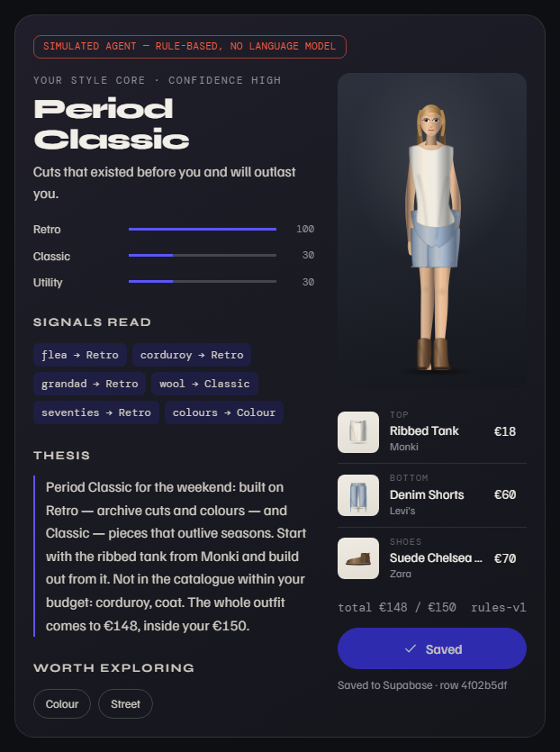
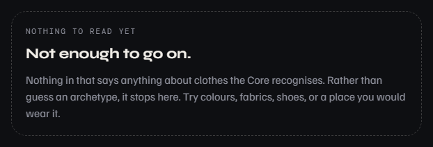
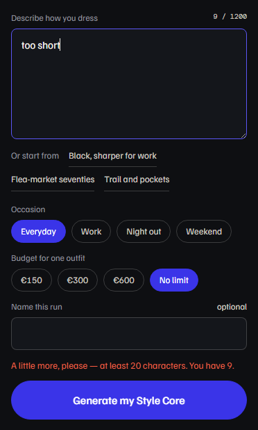

# Test Evidence — Week 1

**Live page under test:** https://style-me-five.vercel.app/core
**Date:** 10 September 2026
**Round 1:** deployment `0dab866` · **Round 2:** deployment `1cf3db5`

---

## How the tests are run

The three self-tests from the Build Discipline Packet are scripted in
`docs/week-1/run-tests.ps1`, so they can be run again by anyone, identically.
This machine has no Node and no Playwright, so the script drives headless Edge
directly over the Chrome DevTools Protocol from PowerShell. Every run uses a
fresh browser profile — a visitor who has never taken the style test, which is
also what a grader opening `/core` is. Every run hits the **live** site and the
**real** database: tests 1 to 3 each save a row.

The script writes its screenshots and a `results.json` with every value it
compared. Two extra checks run alongside the three tests: security (S1) and
mobile layout (M1).

---

## Round 1 — deployment `0dab866`

| # | Test | Input | Expected | Actual | Pass |
|---|---|---|---|---|---|
| T1 | Full loop, live | *Mostly black, oversized, I live in my Doc Martens. I never wear colour…* · work · €300 · "Test 1" | Card appears; Save (clicked twice) makes one row; after a reload the row is first on the dashboard | Card appeared; "Saved to Supabase"; total 1 → 2 after reload; "Test 1" first | ✅ |
| T2 | Extraction quality | *I never wear colour. Black and grey, a leather jacket, heavy boots.* — twice | Colour negative and not in the top three; Edgy leads; both runs identical | Colour −, top three Edgy / Minimal / Classic; identical | ✅ |
| T3 | Edges | *too short* · 40 characters of nonsense · the flea-market text at €150 | Length message, card unchanged · "Not enough to go on." · total ≤ €150 | All three as expected; total €148 | ✅ |
| S1 | Security | the public key, from the live page | `input_text`, `select *` and `DELETE` refused | 401 · 401 · 401 | ✅ |
| M1 | Mobile | 375 px | no horizontal overflow | 0 px | ✅ |

**Round 1 conclusion, as the script reported it: everything passes.**

## Then I looked at the screenshots

### Defect 3 — the outfit contradicts what the person wrote

**Severity:** the product's credibility. **Found by:** reading the card as a
user would, not by the test.

The card above says *"Left out, because you said so: colour"* — and puts the
person in a **green** cardigan and a **blue** shirt, with canvas sneakers for
someone who wrote *"I live in my Doc Martens"*. Test 2's card was worse: *"a
leather jacket, heavy boots"* came back as a beige trench, a dress, and brown
square-toe boots.

**Why the test passed:** it checked the axes and the signals — what the engine
*computes* — and never the clothes, which is what the user *sees*. The outfit
comes from the Week 0 builder, which only knows axes: refusing colour lowers
the Colour axis, but nothing stops a green cardigan with the right tags.

**The check was fixed first.** `run-tests.ps1` now reads the outfit itself: in
T1, every piece must be black, grey or white and a Dr. Martens piece must be in
it; in T2, the same colour rule, plus the leather jacket and the boots. Run
against the live site **before** the fix, it fails as it should:

| | Pieces outside black / grey / white | Named pieces present |
|---|---|---|
| T1 | Fine Knit Cardigan (green), Canvas Tote Bag (beige), Oxford Shirt (blue) | no Doc Martens |
| T2 | Cotton Trench Coat (beige), Square Toe Leather Boot (brown), Ribbed Wool Beanie (blue), Ribbed Tank Dress (beige) | no leather jacket |

**Fix applied** (`1cf3db5`): the Core passes over the built outfit in order of
what matters most — pieces the person named go in (31 patterns: *leather
jacket*, *Doc Martens*, *boots*, *jeans*…), what they refused comes out (pieces,
"never colour", and named colours such as *"nothing black"*), and the budget
holds whatever it costs the first two. Whatever the budget forces through is
said on the card: *"Not in the catalogue within your budget: coat"*, *"the
ribbed tank dress is the exception"*.

### Defects 4 and 5 — found while fixing 3

Checked on a local battery of 208 combinations (13 texts × 4 occasions × 4
budgets) before deploying, which found two more:

- **The budget pass chose the wrong fallback.** When nothing fitted the room
  left, it took the cheapest *allowed* piece rather than the cheapest one — a
  €650 black dress on a €150 budget — and it cut the pieces the person had
  named before the ones they had not. Fixed: unnamed pieces are cut first,
  several passes, and a refusal is only overruled by the budget as a last
  resort. At €150 the cheapest shoe in the catalogue is a boot, and someone who
  wrote *"I hate boots"* now gets a €143 outfit without one.
- **"Nothing black" still produced black.** Refused colour *words* were read as
  signals but not applied to the outfit. Fixed with the same rule as "never
  colour".

Final battery: none over budget, all complete, no duplicate slot, all
deterministic, no refused piece ignored, and every one of the 15 colour
exceptions the budget forces is named in the thesis.

---

## Round 2 — deployment `1cf3db5`, strengthened checks

| # | Test | Actual | Pass |
|---|---|---|---|
| T1 | Full loop + outfit keeps "never colour" and the Doc Martens | Heavyweight Cotton Tee (white), Technical Cargo Trousers (black), Eight Eyelet Boot (black, Dr. Martens) — €274 / €300; total 7 → 8 after reload; "Test 1" first | ✅ |
| T2 | Negation, determinism + colour rule + named pieces | Leather Biker Jacket, Fine Roll Neck, Slim Black Jeans, Eight Eyelet Boot, sunglasses — all black; identical twice | ✅ |
| T3 | Edges | *"A little more, please — at least 20 characters. You have 9."* · *"Not enough to go on."* · €148 / €150, and *"Not in the catalogue within your budget: corduroy, coat."* | ✅ |
| S1 | Security | 200 · 401 · 401 · 401 — `permission denied for table core_outputs` | ✅ |
| M1 | Mobile 375 px | 0 px overflow | ✅ |

### Checked and found clean

- **A header in the middle of the mobile capture** — an artefact of full-page
  capture: the sticky header is drawn where the viewport was when the picture
  was taken. On the page itself, measured: no overlap, no horizontal overflow.
- **Double click on Save** — one row per click pair in every round: totals
  moved by exactly one per test.

---

## Iteration log

| # | What changed | Why | Commit |
|---|---|---|---|
| 1 | Budget repair pass in the Core | €150 budget returned a €340 outfit — found in development | `2800ac4` |
| 2 | Smaller archetype title beside the figure | "Minimalism" ran under the figure at 1280 px | `44f81b1` |
| 3 | Prompt lines unwrapped on `/docs` | Hard line breaks wrapped twice | `8af46a4` |
| 4 | Outfit honours named pieces and refusals, colour included | Round 1 card: "left out: colour" above a green cardigan | `1cf3db5` |
| 5 | Budget pass order and fallback | €650 dress on a €150 budget; "I hate boots" overruled | `1cf3db5` |
| 6 | Test script checks the clothes, not only the axes | It passed while the card was wrong | this document's commit |
| 7 | Screenshots wait for the "Saved" notification to leave | It covered a line of the thesis | this document's commit |

## What this round taught me

Week 0's lesson was that a test round that finds nothing is evidence about the
test. This week the scripted round was *better* than Week 0's — automated,
repeatable, measured — and it still passed a card that contradicted itself in
plain English. The script checked what the engine computed. The defect was in
what a person reads. The fix to the test was one question: *what would the user
check?* — and the answer was the clothes.
