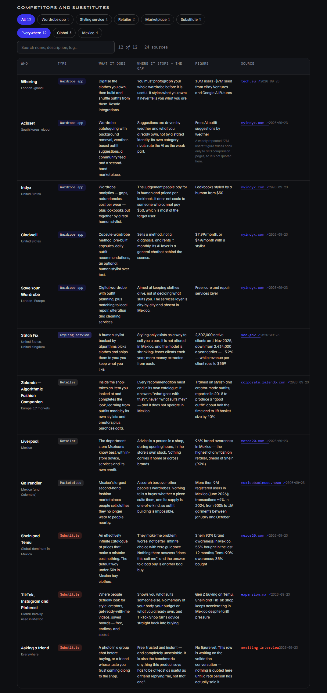
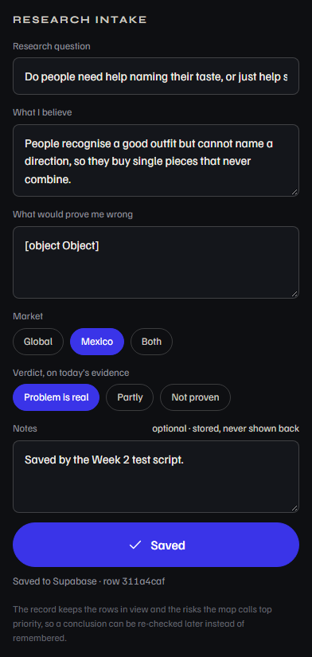
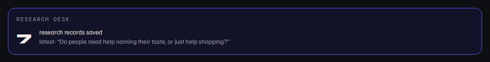
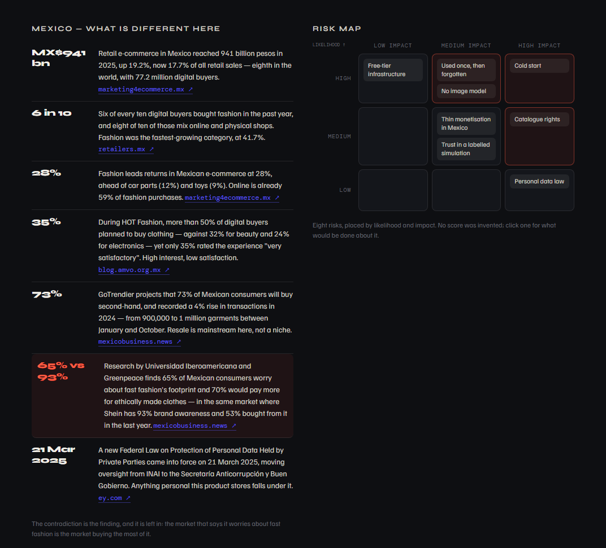

# Test Evidence — Week 2

**Live page under test:** https://style-me-five.vercel.app/research
**Code under test:** deployment `6a8910d`
**Final run:** 24 September 2026, 16:56 (Mexico City, UTC−6)

---

## How the tests are run

The three software tests from the Build Discipline Packet are scripted in
`docs/week-2/run-tests.ps1`, so anyone can run them again, identically. As in
Week 1, the script drives headless Edge over the Chrome DevTools Protocol from
PowerShell — this machine has no Node and no Playwright — with a fresh browser
profile every run: a visitor who has never taken the style test, which is what
a grader opening `/research` is.

Every run hits the **live** site and the **real** database. Test 2 saves a row
to `research_records`; test 3 makes a real HTTP request to every source the
page cites.

One thing changed since Week 1, and it is the point of the week: **test 1
compares the page against the dataset**, not against numbers written into the
test. It reads `SM.research.counts()` — what `research-data.js` says — and
checks the rendered table against that. A test that hard-codes "3 substitutes"
keeps passing after someone deletes a row.

Two checks run alongside the three: security (S1) and mobile (M1).

---

## Results — final run, all five pass

| # | Test | What was checked | Actual | Pass |
|---|---|---|---|---|
| T1 | Filter, search, console | Every type and market chip against `SM.research.counts()`; search narrows, empties and clears; no row without a source; no uncaught error on the page | All six type counts and three market counts matched; "mexico" narrowed to 4, "zzzznothing" gave 0 rows and the empty message, clearing restored 12; rows without a source: 0; header "12 of 12 · 24 sources"; console errors: `[]` | ✅ |
| T2 | Save a record | Intake filled, **Save clicked twice**; reload; then the You-screen widget, reached by taking the style test | "Saved to Supabase"; total 6 → 7, so the double click made one row; the saved question first in the list; widget read "7 research records saved" | ✅ |
| T3 | Sources hold | A real HTTP request to every source cited on the page | 24 claims behind 11 distinct URLs; all 23 web claims answered 200; 0 failures. The 24th is the pending interview, which has no URL and is reported as such rather than counted as a pass | ✅ |
| S1 | Security | The publishable key against `research_records` | allowed columns 200 · `notes` **401** · `select=*` **401** · `DELETE` **401** | ✅ |
| M1 | Mobile, 375 px | Horizontal overflow, and the wide table | Page overflow 0 px; the table scrolls inside its own box rather than stretching the page | ✅ |









## Regression: Week 1 still works

This week touched `views.js`, `app.js` and `app.css` — all shared with the
Style Core. Week 1's own scripted suite was run unchanged against the live site
on 24 September, and all five of its checks still pass:

```
PASS  T1  Full loop: /core loads, Generate, Save (double click), reload, row read back;
          the outfit keeps "never colour" and the Doc Martens
PASS  T2  Negation and determinism; named leather jacket and boots kept
PASS  T3  Edges: under 20 characters, no recognisable cue, EUR 150 budget
PASS  S1  Security: the public key cannot read input_text, select *, or delete
PASS  M1  Mobile 375 px: no horizontal overflow
```

Keeping last week's tests runnable is the cheapest regression suite available,
and it earned its keep the first time it was used.

---

## Defects found this week

Seven. Two were in the product, one was in the research, and four were in the
test tooling — which is its own lesson.

### 1 — A source that could not be checked (found in development)

`investors.stitchfix.com` returns **403** to anything that is not a browser, so
the link test could never verify the most important competitor figure on the
page. Rather than exempt it, the citation moved to Stitch Fix's **10-Q filed
with the SEC** — a primary document, and one that answers a script. The numbers
changed to what the filing says: 2,307,000 active clients on 1 November 2025
against 2,434,000 a year earlier, −5.2%. Fixed in `5698964`.

### 2 — A row citing an interview that had not happened

The substitute row "asking a friend" cited this week's validation conversation
as its source while the conversation was still scheduled for later in the week.
On a page whose single rule is *no claim without a source*, this was the worst
row to get wrong. It now reads **"awaiting interview"** in the source column and
carries no figure. Fixed in `e311d71`.

### 3 — The test opened a URL that does not exist

`run-tests.ps1` navigated to `style-me-five.vercel.app/me` to check the
dashboard widget. Only `/docs`, `/core` and `/research` are rewritten onto the
app, so Vercel served a 404 and the widget was "missing" — a failure entirely
invented by the test. The You screen is a hash route, and it is also behind
onboarding, so the test now **takes the style test in twelve clicks** the way a
real user reaches that screen. Fixed in `6a8910d`.

### 4 — Two hosts refuse a script, for opposite reasons

The link check used PowerShell's web client. `sec.gov` refused it — the SEC
asks for a user agent carrying a contact address — and `marketing4ecommerce.mx`
refused it for the opposite reason, wanting something that looks like a
browser. The check now uses `curl.exe`, which ships with Windows, with the
agent each host expects. Fixed in `6a8910d`.

### 5 — A duplicated byte-order mark

The Week 2 script was assembled from the Week 1 one, and both a fresh BOM and
the inherited BOM ended up at the top of the file. PowerShell lost the first
line and reported `param` as an unknown command. Fixed in `6a8910d`.

### 6 — A figure running under its own text

`MX$941bn` was wider than the column reserved for figures in the Mexico
section, so it printed over the first line of its claim. Caught by reading a
screenshot, not by any assertion. Fixed in `6a8910d`.

### 7 — A check that could not run, and said so

The packet promised a clean console; nothing verified it. A collector was added
— injected before page scripts, gathering `error` and `unhandledrejection` —
and on its first run it reported `["collector missing"]`, because
`Page.addScriptToEvaluateOnNewDocument` does nothing until the Page domain is
enabled. **The run failed rather than passing on an empty list**, which is the
only reason the gap was visible: a check that cannot run must fail, not return
"nothing found". Fixed the same day; the console is now verified empty on
`/research`.

---

## Iteration log

| # | What changed | Why | Commit |
|---|---|---|---|
| 1 | Stitch Fix cited from the SEC filing instead of the press release | The press release refuses scripted requests, so the claim could not be verified | `5698964` |
| 2 | "Asking a friend" marked *awaiting interview* | It cited a conversation that had not happened | `e311d71` |
| 3 | Test onboards, then uses the hash route for the You screen | It was opening a path Vercel does not serve | `6a8910d` |
| 4 | Link check moved to `curl.exe` with a per-host user agent | Two hosts refuse PowerShell's client, for opposite reasons | `6a8910d` |
| 5 | Duplicate BOM removed from the test script | PowerShell could not read the first line | `6a8910d` |
| 6 | Figure column widened, long figures wrap | `MX$941bn` printed over its own claim | `6a8910d` |
| 7 | Console-error collector added, then made to actually run | The packet promised a clean console and nothing checked it | `517aedc` |

---

## What this round taught me

Week 1's lesson was that a test round finding nothing is evidence about the
test. This week the tests found seven things — and four of them were in the
tests themselves, not in the product. A failing test is not the same as a
broken feature, and telling them apart took real work each time: the widget was
"missing" because the test asked Vercel for a page that does not exist, and a
source was "dead" because the SEC does not talk to scripts that fail to
introduce themselves.

The one that will stay with me is the console check that reported *"collector
missing"*. Written the obvious way, it would have returned an empty list and
passed for the rest of the semester without ever looking at anything.

And the defect I care about most was found by neither the tests nor the
browser: reading the page as a reader, where a citation pointed at a
conversation nobody had had yet.
