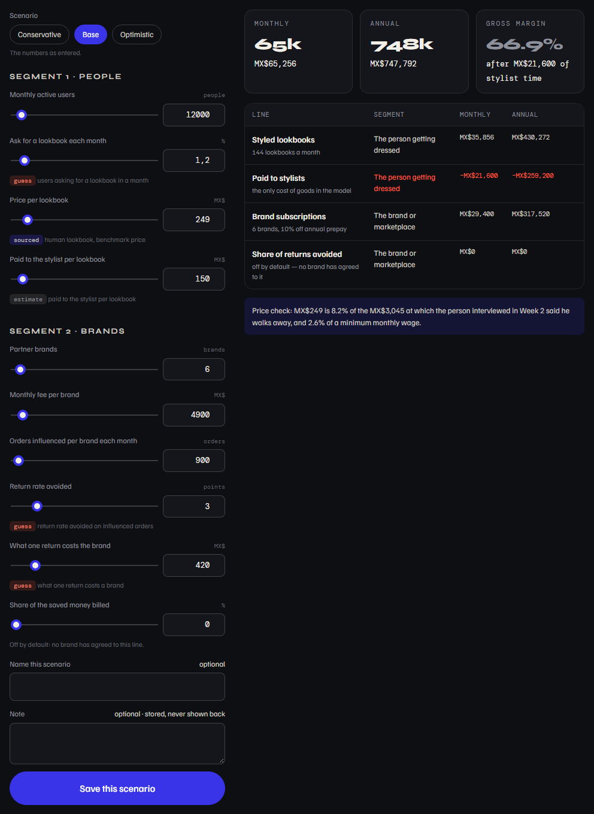
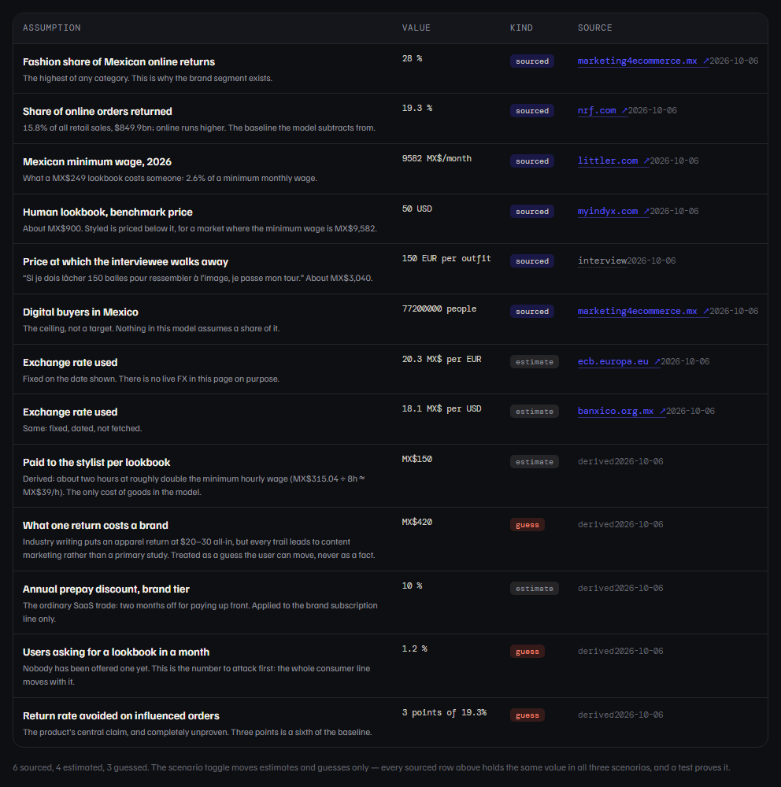
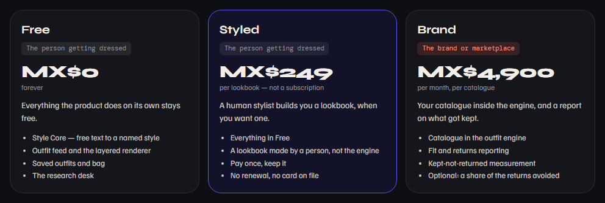
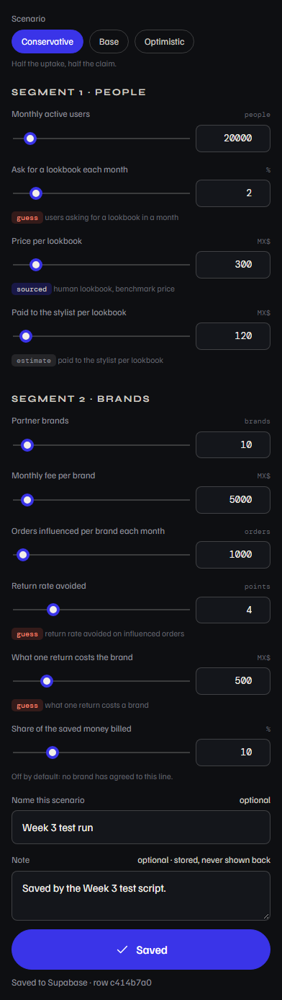

# Test Evidence — Week 3

**Live pages under test:** https://style-me-five.vercel.app/product · https://style-me-five.vercel.app/pricing
**Code under test:** deployment `8813f9a`
**Final run:** 6 October 2026, 21:13 (Mexico City, UTC−6)

The week asks for **2 pricing-logic tests and 3 software tests**. All five are
scripted in `docs/week-3/run-tests.ps1`, plus the standing security check, and
all six pass against the live site.

---

## The two pricing-logic tests

These call `SM.pricing` directly, with no page involved. Arithmetic that can
only be checked by clicking is arithmetic nobody checks.

| # | What was checked | Actual | Pass |
|---|---|---|---|
| L1 | A case worked out **by hand first** and then written into the test: 20,000 users, 2% asking for a lookbook, MX$300 each, MX$120 to the stylist, 10 brands at MX$5,000, 1,000 orders each, 4 points of returns avoided at MX$500 a return, 10% of the saving billed | 400 lookbooks; MX$120,000 styled; MX$50,000 subscriptions; MX$20,000 from returns; **MX$190,000 a month**, **MX$2,220,000 a year**, margin **74.7%** — every figure equal to the hand computation; segments sum to the total; annual equals monthly × 12 less the 10% prepay discount on the brand line | ✅ |
| L2 | Invariants: scenario ordering, the sourced-number rule, zero, and absurd inputs | conservative MX$25,457 ≤ base MX$65,256 ≤ optimistic MX$187,882 on both monthly and annual; **no sourced assumption changes value between scenarios**, checked both by value and structurally (no scenario multiplier reaches an input backed by a sourced assumption); zero users and zero brands give zero revenue; −50,000 users, −MX$10 prices and a 500% take rate are clamped to the declared bounds and produce no negative revenue | ✅ |

Margin is deliberately **not** claimed to be monotone across scenarios: more
lookbooks bring both more revenue and more stylist cost. The test asserts
ordering on revenue only, and says so.

## The three software tests

| # | What was checked | Actual | Pass |
|---|---|---|---|
| S1 | Both pages load, console clean, and the three tiers read identically on `/product` and `/pricing` | 200 on both; console errors `[]` on both; the tier names, prices, units and segments scraped from each page's DOM are character-for-character equal; 10 calculator fields; 13 assumption rows; 12 feature rows, 7 built + 5 planned | ✅ |
| S2 | Fill the calculator with values that are **not** the defaults, pick a non-default scenario, click Save twice, then read the written row back field by field | "Saved to Supabase"; total 0 → 1, so the double click made one row; the stored row carries `scenario: conservative`, `label: Week 3 test run`, `inputs.mau: 20000`, `inputs.takeRate: 10`, `assumptions_version: pricing-v1` — all as entered | ✅ |
| S3 | Responsive sweep on **both** pages at 375, 414, 600, 768, 900 and 1280 px, and an HTTP request to every source cited in the assumptions table | 0 px overflow in all twelve combinations; 0 source failures | ✅ |
| S4 | Security: the publishable key against `pricing_scenarios` | allowed columns 200 · `note` **401** · `select=*` **401** · `DELETE` **401** | ✅ |

## Regression: Weeks 1 and 2 still pass

This week touched `views.js`, `app.js` and `app.css`, all shared with the Style
Core and the research desk. Both earlier suites were re-run unchanged against
the live site, and all ten of their checks still pass — results in
`docs/week-3/evidence/regression/`. Those weeks' own evidence folders were
restored afterwards: re-running their tests overwrites their screenshots, and
evidence of a submitted week should not be quietly replaced by a later run.

---

## Defects found this week

Five. Two in the page, and three in things that looked finished.

### 1 — Two links in the feature map were lying

The renderer row pointed at `/outfit`, which without an id falls through to the
feed, and `/saved` sends a first-time visitor back to the welcome screen. On a
table whose whole claim is "this column says what is real", both were wrong.
The first now points at `/feed`, where the renderer actually runs; the second
carries "after the style test" under the link. Found before pushing, by
clicking them.

### 2 — Figures breaking mid-number

`MX$65,256` rendered as `MX$65,2` / `56`. The culprit was a rule I had added
myself the week before: `overflow-wrap: anywhere`, which treats a thousands
separator as a break opportunity. The figures are now compact (`65k`) with the
exact amount on the line beneath.

### 3 — The revenue columns were off the card

The lines table inherited `min-width: 860px` from the research desk's table,
where six verbose columns need it. Here it pushed **Monthly** and **Annual**
outside the card, behind a horizontal scroll — the two numbers the page exists
to show. A narrower floor for this table fixed it.

### 4 — Amounts printed as a bare `$`

`Intl.NumberFormat('es-MX', { currency: 'MXN' })` renders MXN as `$`, on a page
that also quotes USD benchmarks and a euro walk-away price. Every amount is now
written `MX$` explicitly — which also removed an inconsistency where tier cards
said `MX$0` and the calculator said `$249`.

### 5 — The dashboard session, not the database

The project itself was awake, thanks to the keepalive added last week; the
Supabase **dashboard login** had expired, which blocked the DDL and nothing
else. Worth separating in the notes, because the two failures look identical
from the page and have completely different fixes.

All three of the visual ones were found by reading a screenshot. None of them
would have failed an assertion I had written.

---

## Iteration log

| # | What changed | Why | Commit |
|---|---|---|---|
| 1 | Renderer row points at `/feed`; `/saved` marked "after the style test" | Two links in the feature map did not go where they said | `082951a` |
| 2 | Compact figures with the exact amount beneath | `MX$65,256` was breaking mid-number | `8813f9a` |
| 3 | Narrower minimum width for the revenue table | Monthly and Annual sat outside the card | `8813f9a` |
| 4 | `MX$` written out everywhere | A bare `$` is ambiguous on a page quoting USD and EUR | `8813f9a` |
| 5 | Weeks 1 and 2 suites re-run, their evidence restored | Three shared files changed this week | `90f7694` |

## What this round taught me

The two logic tests were the cheap part: the model is arithmetic, and
arithmetic is easy to pin down once it is in pure functions. What they cannot
see is whether the number reaches the reader — and that is where all three
visual defects lived, including one introduced by a fix I made last week.

The rule worth keeping: **a test proves the number is right, a screenshot
proves the number is readable**, and this project keeps needing both.
